# 앱등이가되
### 원하는 사양에 적합한 애플 제품 추천 및 보유 상품 목록에 따른 티어 체크 서비스

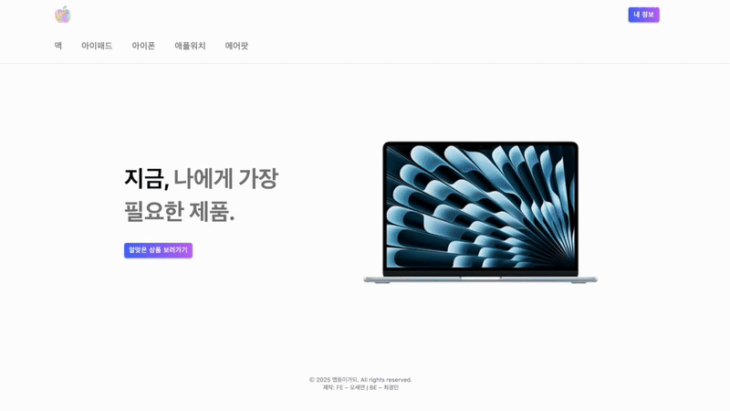

### 프로젝트 개요

원하는 용도에 따라 알맞은 애플 제품 사양을 추천해주고, 현재 또는 과거에 보유했던 애플 제품을 아카이브 하고, 기간과 소비한 액수에 따라 충성도를 티어로 계산합니다.

---

### 사용 툴 및 라이브러리

---

### 주요 기술 및 기능

+ 백엔드 API를 연동하여 비동기 데이터를 페칭하고, 이를 모듈화
+ 한 페이지 내에서도 렌더링 시간 단축을 위해 SSR과 CSR 컴포넌트를 적절하게 구성
+ AccessToken을 활용하여 로그인 및 사용자 인증을 구현하고, 이를 바탕으로 로그인 여부에 따른 라우팅 제한, 좋아요 및 보유 상품 목록과 리뷰 기능 등 구현
+ Tanstack Query를 도입하여 보다 효과적인 비동기 데이터 관리와 상태 관리 로직 개선
+ 제품 카테고리별 이름 검색 및 등록일자, 리뷰 수, 가격 등에 따라 정렬
+ 구글 및 카카오톡 연동 로그인
+ 이메일 인증을 통한 비밀번호 변경
+ 3개의 브레이크 포인트를 갖춘 반응형 디자인

---

## 기능 시연

### 회원가입
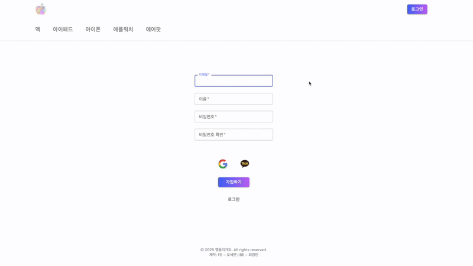

### 로그인
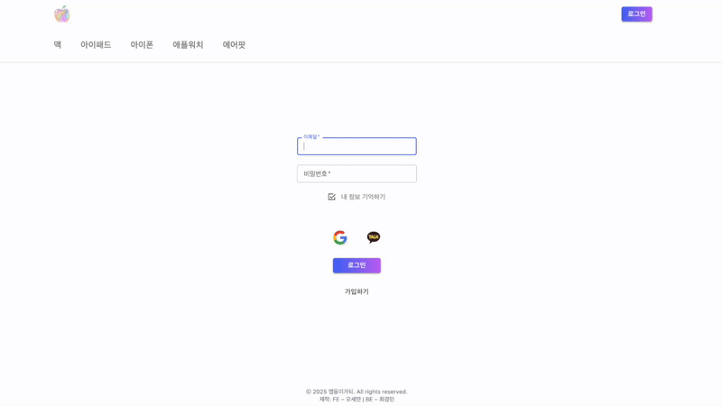

### 이메일로 부여받은 인증코드 기반의 비밀번호 변경
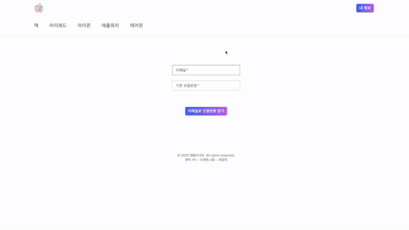

### 제품 카드 정렬
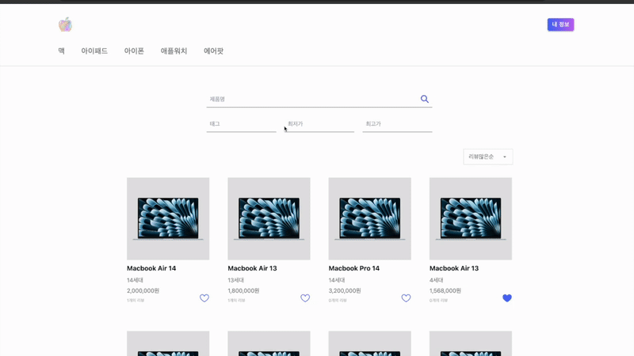

### 위시리스트 추가
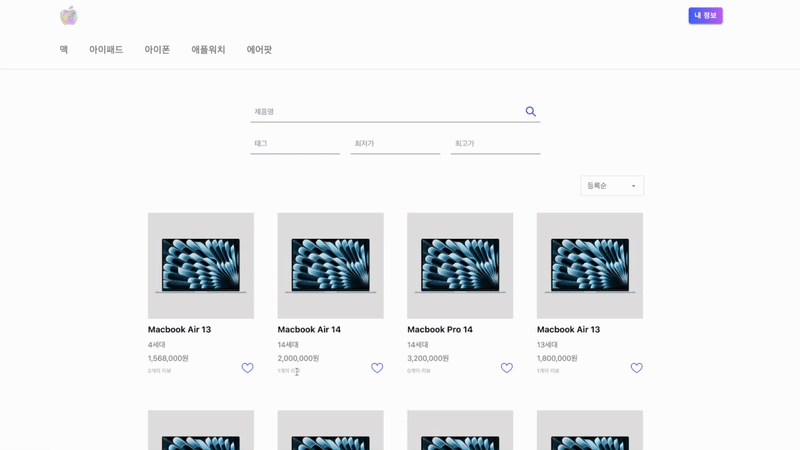

### 위시리스트 삭제
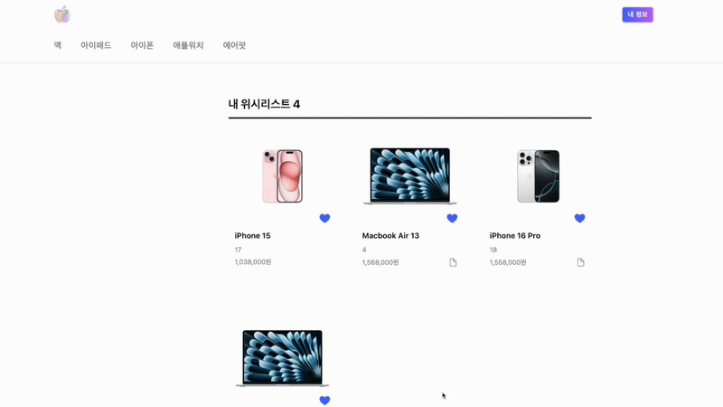

### 회원가입

### 제품 상세페이지
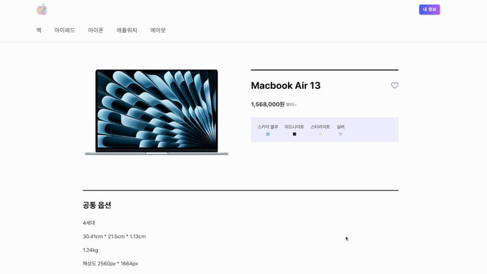

### 사진을 포함한 리뷰 생성 CRUD
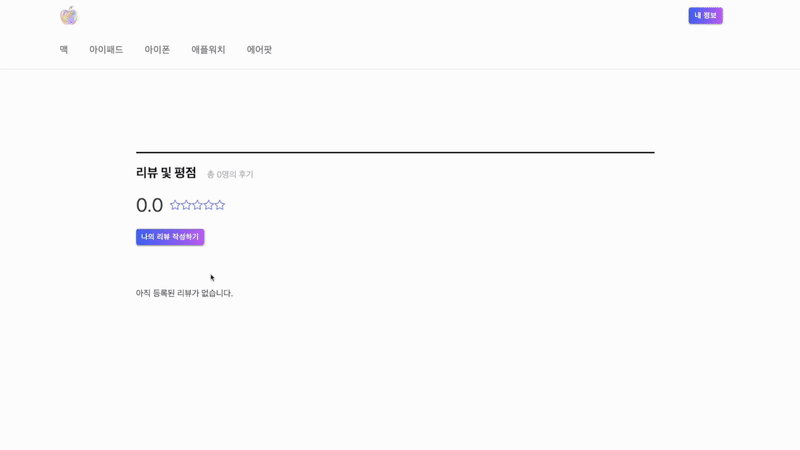

### 보유 제품 추가
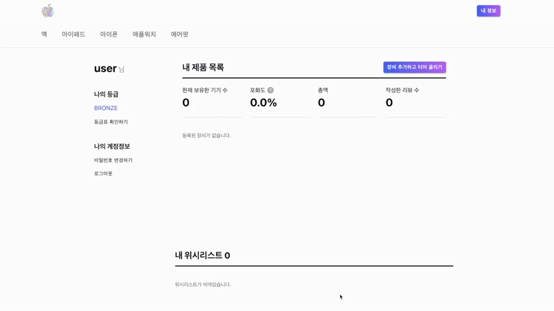

### 보유 제품 수정
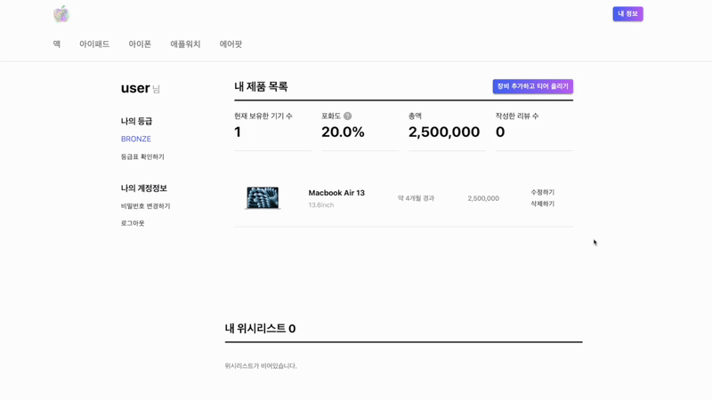
